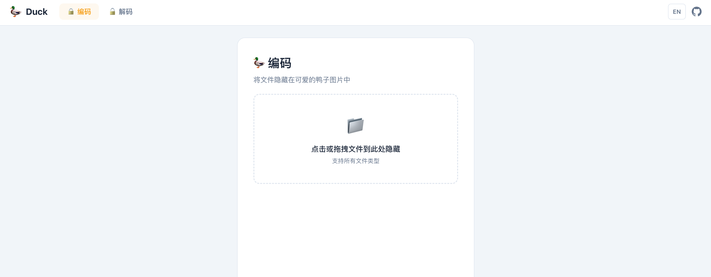
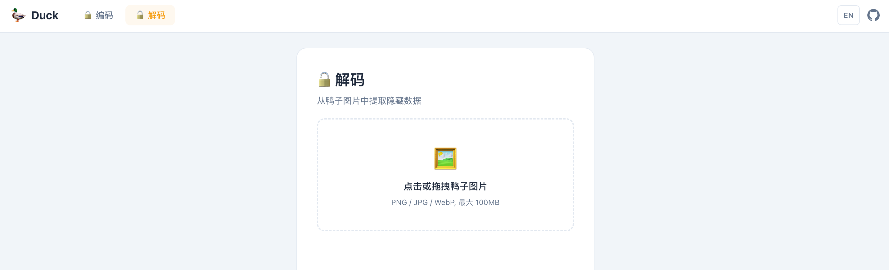

<div>
    <h1 align="center">Duck 🦆</h1>
    <p align="center"><em>LSB 隐写术加解密工具 — 在可爱的鸭子图片中隐藏和提取任意文件。</em></p>
    <p align="center">
        <a href="./README.md">English</a> | <strong>中文</strong>
    </p>
</div>

> [!IMPORTANT]
> 本项目旨在保护个人数据隐私使用，禁止使用此项目进行任何不符合当地法律法规的行为，不得使用此项目侵犯他人数据、版权等权利。开发者本人不承担任何因使用本项目而导致的损失、责任以及法律风险，以上均由使用者自行承担。如果您使用或者部署此项目即视为同意。

## 特性

- **🔒 编码（Encode）** — 将任意类型文件隐藏到鸭子 PNG 图片中
- **🔓 解码（Decode）** — 从鸭子图片中提取隐藏的原始文件
- **🔐 密码加密** — 支持可选的 XOR + SHA-256 密码保护（16 字节随机盐）
- **📦 多级压缩** — 3 种 LSB 嵌入级别：2-bit（高画质）、6-bit（均衡）、8-bit（最大容量）
- **📝 自定义标题** — 可在鸭子图片上显示自定义文字（最多 30 字符）
- **🖼️ BinPNG 转换** — 大文件自动以 PNG 像素格式存储，突破容量限制
- **📎 附加载荷** — 支持在隐藏数据中嵌套额外内容（如二维码信息）
- **📂 批量解码** — 一次解码多个鸭子图片
- **💻 CLI 命令行工具** — 适合脚本和自动化场景
- **🌐 Web 界面** — 基于 Vue 3 的浏览器端图形界面

## 使用

### 网页

https://duck.vince-g.xyz

### 命令行

```bash
npx @vince-gamer/duck-cli -h
```

## 预览





## 开源协议

[MIT License](./LICENSE.md) | Copyright (c) 2026-PRESENT Vincent-the-gamer
